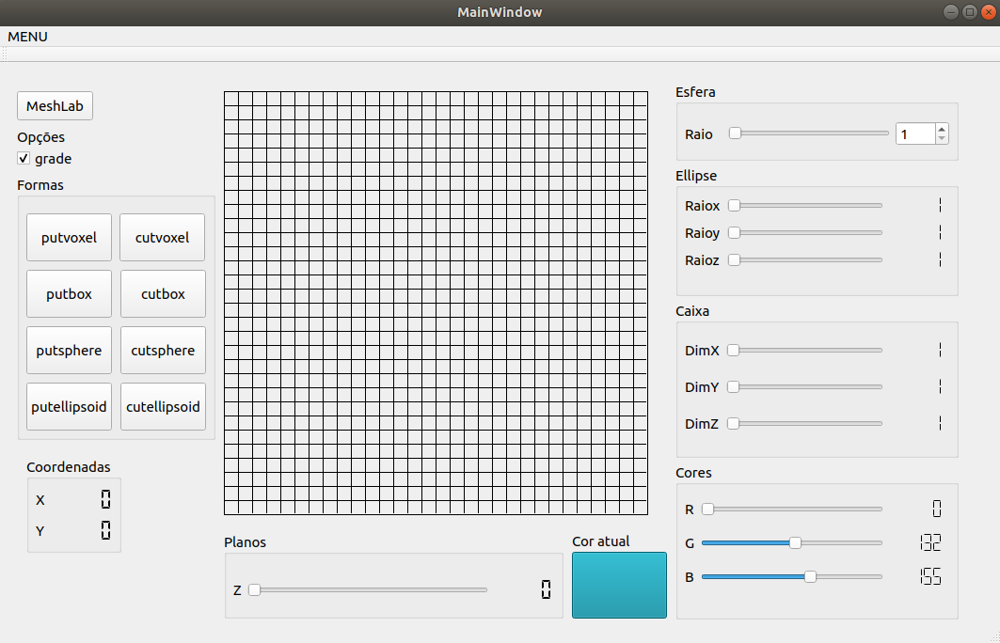

Link da documentação:
https://igordiasv.github.io/Documentacao/inherits.html
<html>

<strong>Sculptor</strong>

&nbsp; &nbsp; &nbsp; &nbsp; &nbsp; &nbsp; &nbsp; &nbsp; &nbsp; O Escultor digital &eacute; um software que permite a cria&ccedil;&atilde;o de figuras tridimensionais, semelhante ao paint 3d, onde no final pode ser salvo em um tipo de arquivo espec&iacute;fico e pode ser executado por outros softwares de visualiza&ccedil;&atilde;o 3d, como o meshlab e geomview.&nbsp; &nbsp; &nbsp; &nbsp; &nbsp; &nbsp; &nbsp;

&nbsp; &nbsp; &nbsp; &nbsp; &nbsp; &nbsp; &nbsp; &nbsp; &nbsp;Semelhante ao conhecido jogo minecraft, todos os objetos so Escultor digital s&atilde;o construidos a partir de um bloco padr&atilde;o simples chamados de voxel. O usu&aacute;rio pode definir a cor e a posi&ccedil;&atilde;o de cada voxel, bem como apagar o voxel de uma posi&ccedil;&atilde;o, e assim criar figuras mais complexas.

&nbsp; &nbsp; &nbsp; &nbsp; &nbsp; &nbsp; &nbsp; O Escultor j&aacute; possui algumas figuras pr&eacute;-definidas prontas para ser usadas, como caixas, esferas e elips&oacute;ides, facilitando assim o trabalho do projetista.

&nbsp; &nbsp; &nbsp; &nbsp; &nbsp; &nbsp; &nbsp; Imagem da tela inicial do Escultor digital

  
</img>

<h4>Como utilizar o programa</h1>

&nbsp; &nbsp; &nbsp; &nbsp; &nbsp; &nbsp; &nbsp; &nbsp; &nbsp;Ao iniciar o programa, será aberto a janela principal, onde todas as funcionalidades vão está a vista do usuário. Para criar um novo projeto basta clicar <strong>CTRL+N</strong>. As ferramentas de desenho se encontram do lado esquerdo da tela, no centro está está posicinado a tela onde de fato o usuário vai desenhar e do lado direito os botões de arraste que configuram as formas de desenhos, bem como as cores. Por padrão, a forma inicial de desenho é o "Putvoxel" que clicar na tela será pintado apenas um quadrado da cor selecinada, que por padrão é branca. O usuário tem à disposição 8 tipos de formas de desenho sendo 4 delas de desenho e 4 de corte.

&nbsp; &nbsp; &nbsp; &nbsp; &nbsp; &nbsp; &nbsp; &nbsp; &nbsp;Na parte inferior da tela possui um botão de araste que varia entre os planos matriz 3D, e a cor atual. Ao clicar no quadrado de "cor atual" será aberta uma pelheta de cores, ou, caso o usuário queria, a cor pode ser modifica diretamente pelos botões de arraste de cor, definindo os níveis de vermelho, verde e azul da cor desejada.

&nbsp; &nbsp; &nbsp; &nbsp; &nbsp; &nbsp; &nbsp; &nbsp; &nbsp;A qualquer momento o usuário pode visualizar o projeto diretamente na ferramenta de visualização 3D Meshlab, para isso certifique-se de a ter instalada em sua máquina. Caso o usuário queira salvar o projeto, mas tem intenção de continuar posteriormente, pode apenas clicar <strong>CTRL+S</strong>, e escolher a pasta onde deseja salvar, lembrando que desse modo não será salvo em com a extensão .off, portanto não pode ser visualizado no Meslab, mas pode ser editado. Mas caso o usuário queira finalizar o projeto e gerar um arquivo com extensão, basta ir na parte superior da tela e procurar pela palavra "MENU". na aba menu tem a opção "Exportar Projeto", logo após basta escolher a pasta onde será salvo. O arquivo .off final não poder ser editado aberto e editado no Escultor digital

&nbsp; &nbsp; &nbsp; &nbsp; &nbsp; &nbsp; &nbsp; &nbsp; &nbsp;Para abrir um projeto já inacabado ou ja existente, basta clicar <strong>CTRL+O</strong> e escolher um arquivo do seu computador.

<strong>Principais fun&ccedil;&otilde;es&nbsp;</strong>

<h4>Principais funcionalidades</h4>

<strong>Abrir Projeto</strong>: encontra-se na aba menu e tem como funcionalidade abrir um projeto salvo, no&nbsp;padr&atilde;o usado pelo sculpor,&nbsp;para&nbsp; dar continuidade.

<strong>Salvar Projeto</strong>:&nbsp;&nbsp;encontra-se na aba menu e tem como funcionalidade salvar o projeto no padr&atilde;o do sculptor.

<strong>Exporta Projeto</strong>:&nbsp;encontra-se na aba menu e tem como funcionalidade salvar o desenho feito em um formato .off que poder lido por programas de visualiza&ccedil;&atilde;o 3d.

<strong>PutVoxel</strong>: desenha um quadrado.

<strong>CutVoxel</strong>: remove o desenho de um&nbsp;&nbsp;quadrado.

<strong>PutBox</strong>: desenha uma caixa com as dimen&ccedil;&otilde;es de altura,largua e profundidade que podem&nbsp;ser&nbsp; definidas&nbsp;nos sliders.&nbsp;

<strong>CutBox</strong>: revome o desenhor que estiver na regi&atilde;o da caixa com dimen&ccedil;&otilde;es definidas pelos sliders.

<strong>PutSphere</strong>: desenha uma esfera cujo centro é onde o mouse for clicado, o raio é definido pelo slider  "raio".

<strong>CutSphere</strong>: apaga uma esfera cujo centro é onde o mouse for clicado, o raio também é definido pelo slider  "raio".

<strong>PutEllipsoid</strong>: desenha um elipsóide cujo centro é onde o mouse for clicado, o raio na coordenada X, Y e Z é definido pelos sliders  "RaioX", "RaioY" e "RaioZ".

<strong>CutEllipsoid</strong>: apaga um elipsóide cujo centro é onde o mouse for clicado, o raio na coordenada X, Y e Z é definido pelos sliders  "RaioX", "RaioY" e "RaioZ".

<strong>Cores:</strong>&nbsp;Permiter escolher uma cor por meio dos seletores de cores do sistema ou usando o sliders que seguem o padr&atilde;o rgb.

</html>

