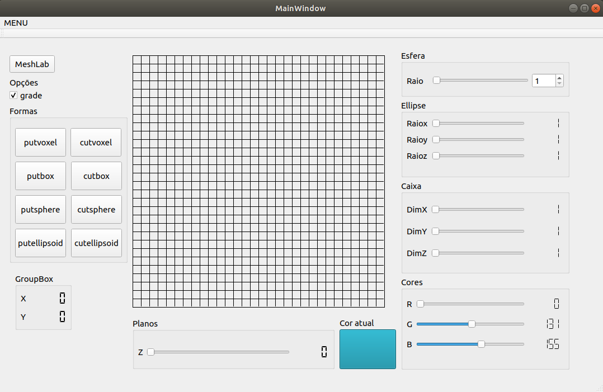

Link da documentação:
https://igordiasv.github.io/Documentacao/inherits.html
<html>

<strong>Sculptor</strong>

&nbsp; &nbsp; &nbsp; &nbsp; &nbsp; &nbsp; &nbsp; &nbsp; &nbsp; O Escultor digital &eacute; um software que permite a cria&ccedil;&atilde;o de figuras tridimensionais, semelhante ao paint 3d, onde no final pode ser salvo em um tipo de arquivo espec&iacute;fico e pode ser executado por outros softwares de visualiza&ccedil;&atilde;o 3d, como o meshlab e geomview.&nbsp; &nbsp; &nbsp; &nbsp; &nbsp; &nbsp; &nbsp;

&nbsp; &nbsp; &nbsp; &nbsp; &nbsp; &nbsp; &nbsp; &nbsp; &nbsp;Semelhante ao conhecido jogo minecraft, todos os objetos so Escultor digital s&atilde;o construidos a partir de um bloco padr&atilde;o simples chamados de voxel. O usu&aacute;rio pode definir a cor e a posi&ccedil;&atilde;o de cada voxel, bem como apagar o voxel de uma posi&ccedil;&atilde;o, e assim criar figuras mais complexas.

&nbsp; &nbsp; &nbsp; &nbsp; &nbsp; &nbsp; &nbsp; O Escultor j&aacute; possui algumas figuras pr&eacute;-definidas prontas para ser usadas, como caixas, esferas e elips&oacute;ides, facilitando assim o trabalho do projetista.

Imagem da tela inicial do Escultor digital

  
</img>

<strong>Principais fun&ccedil;&otilde;es&nbsp;</strong>

<strong>Abrir Porjeto</strong>: encontra-se na aba menu e tem como funcionalidade abrir um projeto salvo, no&nbsp;padr&atilde;o usado pelo sculpor,&nbsp;para&nbsp; dar continuidade.

<strong>Salvar Projeto</strong>:&nbsp;&nbsp;encontra-se na aba menu e tem como funcionalidade salvar o projeto no padr&atilde;o do sculptor.

<strong>Exporta Projeto</strong>:&nbsp;encontra-se na aba menu e tem como funcionalidade salvar o desenho feito em um formato .off que poder lido por programas de visualiza&ccedil;&atilde;o 3d.

<strong>PutBox</strong>: desenha uma caixa com as dimen&ccedil;&otilde;es de altura,largua e profundidade que podem&nbsp;ser&nbsp; definidas&nbsp;nos sliders.&nbsp;

</html>

